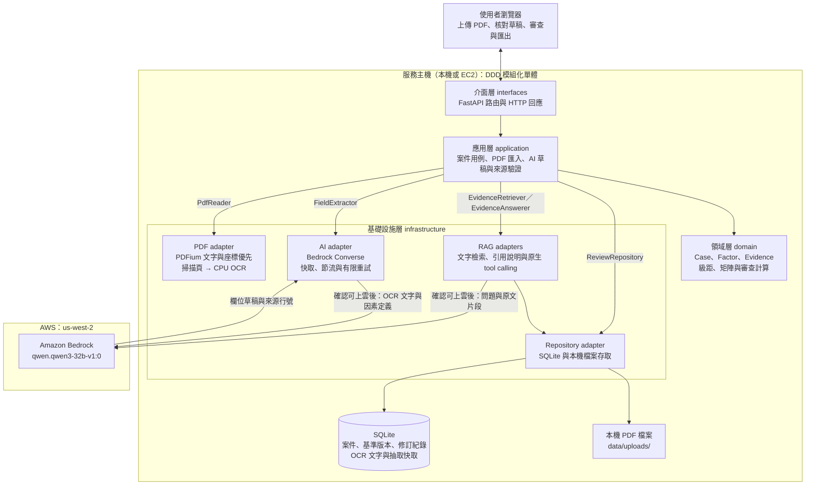
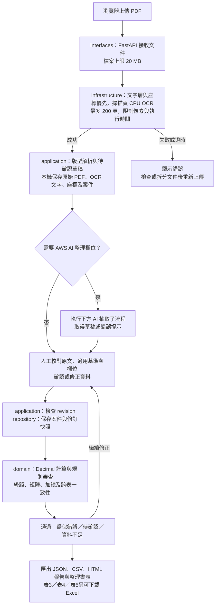
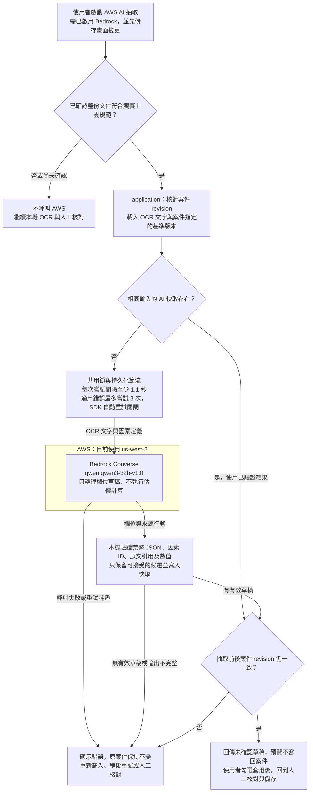

# 沒有錯的地方 Landwise · PaddleOCR + Amazon Bedrock

估價審查工作台，可部署於 AWS EC2。上傳 PDF 優先讀取**可用的文字層與座標**；掃描頁交給 **PaddleOCR／RapidOCR 在 CPU 辨識**。需要 AI 整理欄位時使用 **Amazon Bedrock**。計算、級距與矩陣仍由確定性規則引擎執行，草稿須人工確認。

「匯出成果」提供適用任意 ruleset 的完整審查 Excel、HTML 列表報告、CSV、JSON，以及表3／表4／表5各自的固定模板 Excel。PDF 輸出已移除。表格範例位於 [out_put_teamplate/](out_put_teamplate/README.md)，設定見 [分表輸出](docs/form-exports.md)。

> **開發者／coding agent 請先讀：[AGENTS.md](AGENTS.md) → [TODO 與 DDD 分工](docs/TODO.md) → 負責目錄的 `AGENTS.md`。** TODO 包含介面規劃、前置任務與驗收條件；每項工作使用自己的功能分支，經 PR 審查。

共用資料、ports、精度與版本相容規格見 [契約文件](docs/contracts.md)。現行操作中，修改因素會清除該列與總計確認；更換基準、來源或案件適用背景會清除全部確認。請先儲存修改，再勾選確認新版本；匯入 JSON 與採用建議也遵循同一規則。

## 目前專案架構

網站、OCR、規則計算及資料保存可在本機或 AWS EC2 單機執行，AWS Bedrock 提供模型推論。部署與存取方式見 [AWS 部署](docs/aws-deployment.md)。圖中的箭頭表示執行流程；應用層透過 ports 使用基礎設施，由 `bootstrap.py` 注入具體實作。



上傳先逐頁讀取可用文字層與座標，其他頁面走所選 OCR 引擎，再保存原始 PDF、文字與待確認案件。AI 抽取由使用者另外啟動，預覽不修改案件；套用後仍須人工核對，估價判定由領域規則引擎執行。目前保留單一比較標的；AWS 使用相同程式與 ports，單機部署方式見 [部署文件](docs/aws-deployment.md)。

## 基準文件 RAG

案件內按「依據問答」，先加入綁定該基準版本及適用期間的 PDF，再查找來源或請 Bedrock 生成附引用說明。本機檢索不需要 AWS；生成前須確認問題與來源可上雲。找不到符合案件版本、地區、用地及日期的依據時不生成答案。

目前使用中文文字檢索基線，不使用向量或 GraphRAG。引用包含文件、頁碼、原文與版本；AI 不修改案件、不執行估價運算。完整操作、API 與限制見 [RAG 文件](docs/rag.md)。

「Agent 自動查詢」使用 Bedrock Converse tool calling，自行選擇搜尋、讀取來源頁、查看規則或呼叫確定性審查。介面顯示工具紀錄與原始引擎結果，詳見 [Agentic RAG](docs/agentic-rag.md)。

## 審查流程與競賽限制

以下為目前已實作的主要操作路徑。DDD 的 application 層編排流程，infrastructure 層處理 OCR、AWS 與儲存，domain 層負責確定性計算；HTTP 與畫面呈現結果。

### PDF 上傳到審查匯出



載入案件時也會計算目前審查狀態；未確認資料不會自動通過。儲存時若 revision 已過期，回傳衝突並要求重新載入。尚有疑點的案件仍可匯出，報告會保留待確認狀態。**原書表套印、多比較標的及 GraphRAG 仍列於 [TODO](docs/TODO.md)，未包含在已完成流程中。**

### AWS AI 抽取子流程



引用與數值存在性檢查不代表模型已選對欄位或比較方向。上雲確認是使用者的資料適用性確認，程式目前沒有自動辨識所有受限資料；將 PDF 轉成 OCR 文字不會解除原資料的限制。雲端整合測試只使用合成文件。

### 規範如何反映在流程中

依 `REFERENCE_DATA_DIR` 下的 `黑客松競賽環境規範與限制_20260722.pdf` 第 1–2 頁，對照目前程式如下；若賽期間公告有調整，以主辦最新規範與實際環境為準。

| 競賽規範 | 目前流程／實作 |
| --- | --- |
| 禁止將個資、財務資訊等受限資料引入 AWS | 呼叫前確認整份文件適用性；未確認時保留本機處理路徑，測試使用合成資料 |
| Bedrock 每秒 1 個請求以下 | 同一主機共用鎖、持久化節流及至少 1.1 秒間隔；重試同樣經過節流，命中快取不呼叫模型 |
| 指定主要部署區域為 `us-east-1`、`us-west-2` | 程式只接受這兩區，預設 `us-west-2`；本版使用區域內模型 ID，拒絕跨區 inference profile |
| 僅使用必要模型與資源，不建議大規模訓練 | 本機 CPU 執行 PaddleOCR，需要 AI 時才呼叫設定的模型；目前沒有模型訓練流程 |
| GitHub 不得包含機密憑證 | `.env` 被 Git 忽略，保留不含金鑰的 `.env.example`；AWS SDK 從 profile、環境或 role 讀取憑證 |
| S3 不可公開、EC2 Security Group 不可完全開放、RDS／EMR 不可公開存取 | AWS 單機部署使用指定 IP 的 Security Group；不建立 S3、RDS 或 EMR |

本機節流只涵蓋共用相同資料目錄的應用程序，不會限制同帳號其他工具或其他主機的模型請求；團隊使用 AWS CLI 或新增服務時仍須共同遵守帳號的請求限制。

## 快速開始（Windows，Python 3.12）

```powershell
python -m venv .venv
.\.venv\Scripts\python.exe -m pip install -r requirements-ocr.txt
powershell -NoProfile -ExecutionPolicy Bypass -File .\start.ps1
```

開啟 http://127.0.0.1:8000 。Windows 啟動腳本在未指定 `OCR_RECOGNITION_MODEL` 時，
使用 `PP-OCRv5_mobile_rec`，降低本機 CPU 辨識密集表格的等待時間；偵測仍使用
`PP-OCRv5_mobile_det`。首次使用會下載模型，辨識結果仍須核對原文。
可先設定 `$env:OCR_RECOGNITION_MODEL='PP-OCRv5_server_rec'` 再啟動，以使用大型辨識模型。
每份 PDF 預設等待上限為 900 秒，模型及實際上限可在 `/api/health` 查閱。
`start.ps1` 使用目前 PowerShell 的環境變數，不會自動載入 `.env`。

## 快速開始（macOS / Linux，Python 3.12）

```bash
python3.12 -m venv .venv
.venv/bin/python -m pip install -r requirements-ocr.txt
cp .env.example .env
```

編輯 `.env` 的 `AWS_PROFILE` 與 `REFERENCE_DATA_DIR`，然後：

```bash
./start.sh
```

開啟 http://127.0.0.1:8000 。`start.sh` 會載入本機 `.env`；直接執行 `python run.py` 則使用該 shell 已存在的環境變數。首次 OCR 會下載官方模型至使用者的 PaddleX 快取目錄，需可連線網路；下載內容是模型，PDF 由本機處理。

原生 JavaScript / CSS 由 FastAPI 提供，不需前端建置。`npm` 僅用於 Playwright 測試與簡報工具。

## 切換本機 OCR 引擎

預設 `OCR_ENGINE=paddleocr`，沿用 `requirements-ocr.txt`。使用 RapidOCR ONNX CPU 時：

```bash
.venv/bin/python -m pip install -r requirements-rapidocr.txt
```

在 `.env` 設定 `OCR_ENGINE=rapidocr`，重新啟動服務；`/api/health` 的 `ocr_provider`、
`ocr_detection_model` 與 `ocr_recognition_model` 可核對目前設定。RapidOCR 使用固定
PP-OCRv5 模型，支援 `PP-OCRv5_mobile_det`／`PP-OCRv5_server_det` 與
`PP-OCRv5_mobile_rec`／`PP-OCRv5_server_rec`；預設仍為 mobile det + server rec。
模型首次下載後存於使用者的 `~/.cache/rapidocr/`，文件在本機辨識。

切換只影響新上傳的題目、評價基準與依據文件。頁面來源的 `method` 保存實際引擎，
文字框、信心值與人工確認流程不變。既有案件、文件及 audit 不重新辨識；同一 PDF
重新上傳會建立新文件。OCR 快取區分引擎、模型、DPI 與執行緒設定；此版啟用新的快取
namespace，舊快取保留但不直接重用。回復時把 `OCR_ENGINE` 改回 `paddleocr` 並重啟，
不需修改或清除 SQLite。失敗會顯示錯誤，不自動切換引擎或改讀文字層。

切換驗收與限制見 [OCR 引擎文件](docs/ocr-engines.md)。

## AWS 身分與模型

AWS 憑證使用 SDK 標準查找鏈，不寫進程式或提交 Git。可使用臨時 session credentials、AWS CLI profile、EC2 instance role，或 SDK 支援的 Bedrock API key。

```bash
aws configure --profile landwise-hackathon
# 臨時憑證另外需要 session token；請使用 AWS CLI 或受保護的 ~/.aws/credentials 設定。
aws sts get-caller-identity --profile landwise-hackathon
```

本地 `.env` 僅需選擇 profile 與非機密設定：

```bash
AWS_PROFILE=landwise-hackathon
AWS_DEFAULT_REGION=us-west-2
BEDROCK_MODEL_ID=qwen.qwen3-32b-v1:0
BEDROCK_ENABLED=true
```

若使用 Bedrock API key，可在啟動 shell 設定 `AWS_BEARER_TOKEN_BEDROCK`；不要將其加入 Git。使用 EC2 role 時移除 `AWS_PROFILE`，讓 SDK 使用 instance role。模型須支援 Converse，並在所選區域具有實際呼叫權限。

預設使用區域內的 `qwen.qwen3-32b-v1:0`。此版本拒絕跨區 inference profile，避免隱含跨區路由。`/api/health` 顯示提供者、模型與區域；設定成功不代表憑證仍有效，實際呼叫錯誤會顯示可處理的訊息。

## 使用流程

1. 上傳特定地區的評價基準明細表，填寫地區與適用期間。
2. 文字層／OCR 轉成 structured ruleset 草稿；人工核對矩陣方向後建立不可覆寫版本，原始 PDF 同時加入該版本的本機檢索來源。
3. 選擇已確認的 ruleset，再上傳 20 MB 以內、最多 200 頁的題目 PDF。
4. 文字層／OCR 擷取題目文字；程式只整理明確出現的行政區、詳細地址與可唯一對應的動態因素列，其他內容保持待確認。
5. 如需 AI，按「AWS AI 抽取」，確認此文件符合競賽上雲規範後，將辨識文字送至 Bedrock。
6. 規則引擎核對等級、修正率、加總與跨表數值；每次修改保存版本及快照。
7. 匯出完整審查 Excel、CSV、JSON、可列印 HTML 報告或既有固定模板分表。

內建案例是 `app/domain/sample.py` 的人工整理資料，並非現場 AI 推論結果。**上傳預設啟用文字層加速**：符合條件的數位頁保留 `pdf-text` 來源標記與座標；含圖片、不可用文字或不支援的頁面變換時逐頁改走設定的 OCR 引擎。可用 `PDF_TEXT_LAYER_ENABLED=false` 關閉。詳見 [文字層加速與限制](docs/pdf-text-fast-path.md)。

## DDD 結構

以「估價審查」為一個 bounded context，採模組化單體與 ports/adapters：

```text
app/
  domain/          Case、Factor、Evidence、Totals、規則及審查計算
  application/     案件操作、PDF 匯入、AI 草稿、來源驗證、介面契約
  infrastructure/  PaddleOCR、Bedrock、SQLite、檔案與環境設定
  interfaces/      FastAPI HTTP 路由、CSV / HTML 等輸出
  bootstrap.py     注入具體 PDF / AI / repository adapters
  main.py          ASGI 入口
static/            操作介面
scripts/           合成資料整合測試、教學與簡報工具
tests/             領域、應用流程、介接契約及選用真實 OCR 測試
```

領域與應用層不依賴 FastAPI、Paddle、AWS 或 SQLite。舊的 `app.models` / `engine` / `rules` 等保留相容匯入，實作已搬入上述各層。詳見 [架構與部署邊界](docs/architecture.md)。

## 資料與設定

預設案件、版本、辨識文字與抽取快取存於 `data/review.sqlite3`，上傳檔案存於 `data/uploads/`。`APP_DATA_DIR` 可指定資料目錄；同一台主機的服務程序須共用此目錄，才能共用 Bedrock 節流與快取。

`REFERENCE_DATA_DIR` 預設為相鄰的 `../aws`，支援其中 `範例/`、`其他參考資料/` 的既有目錄配置；找不到時才檢查專案根目錄。原始規範及案例 PDF 不會被複製進 Git。

| 設定 | 預設 | 用途 |
| --- | --- | --- |
| `AWS_DEFAULT_REGION` | `us-west-2` | 也接受優先的 `AWS_REGION`；僅允許競賽指定兩區 |
| `BEDROCK_MODEL_ID` | `qwen.qwen3-32b-v1:0` | 區域內 Converse 模型 |
| `BEDROCK_ENABLED` | `true` | `false` 關閉雲端 AI，仍可使用 OCR 與規則 |
| `BEDROCK_MIN_INTERVAL` | `1.1` 秒 | 所有模型嘗試間隔，包含重試 |
| `OCR_ENGINE` | `paddleocr` | 可設為 `rapidocr`；安裝對應依賴後重啟服務 |
| `PDF_TEXT_LAYER_ENABLED` | `true` | 優先抽取可用文字層及像素座標；`false` 強制全部頁面使用 OCR |
| `OCR_DPI` | `180` | PDF 轉圖片解析度（72–300） |
| `OCR_CPU_THREADS` | `2` | CPU 執行緒數（1–8） |
| `OCR_TIMEOUT_SECONDS` | `900` | 每份 PDF 的辨識逾時（秒）；CPU 多頁密集表格可能超過 5 分鐘，可設定 10–1800 秒 |
| `OCR_DETECTION_MODEL` | `PP-OCRv5_mobile_det` | 文字偵測模型 |
| `OCR_RECOGNITION_MODEL` | `PP-OCRv5_server_rec` | 文字辨識模型 |
| `SEED_EXAMPLES` | `true` | AWS 環境應設 `false`，只匯入符合規範的資料 |

OCR 在獨立子程序執行；超過時間會終止，不把 AWS 憑證環境變數傳給子程序。每頁限制最大約 1,400 萬像素。長文件或密集表格請拆分；AI 輸入上限為 60,000 字元，模型截斷輸出不會成為草稿。

## 競賽環境

依相鄰 aws 資料夾的 2026-07-22 規範：

- 預設 `us-west-2`；亦可設定 `us-east-1`。
- OCR 使用 CPU，不依賴配額為 0 的 EC2 G / P GPU 系列。
- Bedrock 每次呼叫及重試都通過跨程序鎖與持久化節流；SDK 自動重試已關閉。相同 PDF / OCR 設定及相同 AI 輸入 / 模型 / 基準 / prompt 版本可重用快取。
- 呼叫前須確認資料符合規範。禁止個資、財務資訊等受限資料；附件價格資料的適用界線須由主辦說明，程式中的勾選不是自動合規認證。
- AWS 單機部署使用 EC2、IAM role 與 Systems Manager，網站入口限定指定 IP；不建立 S3 或 RDS。

目前的協調機制適用於**單台主機、共用 SQLite 與鎖檔**。多台 EC2 各自儲存的資料庫無法共用節流；擴充時需改用集中式請求工作程序。應用程式也無法限制同帳號中其他程式自行呼叫 Bedrock。

## 基準及計算設計

既有金山 ruleset 結構包含 `scope`、`unit`、`bands`、`matrix`、`source_page`，矩陣為
**列＝比準地、欄＝比較標的**。樹林普通住宅的獨立 domain API 則以明確參數名稱保存其表格語意：
**列＝目標區段、欄＝基準區段**；兩者尚未串接，不可在整合時直接混用方向。矩陣儲存百分點，
計算時才除以 100。採用 `Decimal`，不以二進位浮點數累加。

- 數值級距採「下限含、上限不含」，深度包含不連續級距（未滿 10 m 或 100 m 以上均為劣）。
- 文字分類只對照明訂值；`null` / 空白、`0`、`無` 與免比較不混用。
- 匯入欄位未確認、基準適用性不符、基準被封鎖、特殊調整 / 免比較或未定義級距，均不自動通過。
- 原填加總與基準重算分開顯示。上游不完整時不輸出基準總額；原填數值齊全時仍可做純算術一致性檢核。
- 絕對值加總＝日期調整率絕對值＋區域細項絕對值之和＋個別細項絕對值之和，避免正負相消。
- 本 MVP 日期單價公式：正常單價 × (1 + 日期調整率)，顯示取整元；試算價格公式：基準日單價 × (1 + 區域調整率) × (1 + 個別調整率)，四捨五入至元。
- **範本中間精度不可完全由顯示值還原**：184,763 × 1.02 = 188,458.26，範本填 188,459；188,459 × 1.13 = 212,958.67，範本填 212,958。價格差不超過 1 元時標示待確認精度，不直接認定錯誤，也不自動更正。

基準庫驗證矩陣尺寸、有限數值、同級零修正、重複分類及重疊級距。它無法認證使用者輸入的規則是否適合法規或案件。自訂版本需記錄正確來源，並自行確認。

### 評價基準明細表轉 structured ruleset

Python application service 可將 PaddleOCR 保留座標的結果，編譯成不綁定行政區、因素名稱、
級數、門檻或修正率的 structured ruleset 草稿：

```python
from pathlib import Path

from app.bootstrap import build_ruleset_extraction_service
from app.infrastructure.settings import Settings

source = Path("評價基準明細表.pdf")
service = build_ruleset_extraction_service(Settings())
result = service.extract(
    source.read_bytes(),
    source_name=source.name,
    expected_locality="上游已確認的縣市行政區",
)
payload = result.to_dict()
```

`expected_locality` 只用來核對表格標題，不做地址解析或地理編碼。解析器依 OCR 的表格座標、
等級列、備註級距與 N×N 矩陣產生規則；不同地區若沿用相同官方表格結構，只需換 PDF 與
地區文字，不需增加 `if city`、`if district` 或地區專用 grading function。數值以 `Decimal`
保存，JSON 輸出為字串，不會自行 rounding、補值或修復 OCR 數字。

所有 OCR 結果固定為 `requires_confirmation=True`。未辨識完整、原文有重疊／缺口、或無法
安全表達的條件會降級為 `manual` 並列入 `warnings`；版型明顯不同的文件會明確失敗，而不
猜測可執行規則。網站的「上傳評價基準表」會呼叫此服務；確認適用期間與來源矩陣方向後，
系統將它投影到既有案件審查契約並保存版本，同一份已 OCR 的原始 PDF 會直接成為該版本的
檢索來源。來源列為目標、欄為基準時，確認步驟會轉置成現行引擎的「列＝比準地、欄＝比較標的」。

### 原文件的待確認事項

`評價基準明細表範例.pdf` 第 2 頁「站牌」普通級距印為 `200km以上未滿400m`，第 3 頁「觀光遊憩」稍劣級距印為 `1,000km以上未滿1,500m`。內建規則保存為**封鎖的候選級距**（以 m 表示候選數字），並保留原文警告；不能直接執行判定。須確認來源後建立新版本。

區域交流道、廢棄物處理設施與環境污染範例沒有明確的「無」級距，保留資料不足。範本人工整理案例因此不會顯示完全通過。

手冊為民國 104 年 3 月版。本作品是提供文件的案例審查 MVP；正式上線前應確認適用版本及承辦人員的判定流程。

## 測試

一般測試不下載 OCR 模型、不呼叫 AWS：

```bash
.venv/bin/python -m pytest -q
```

外部範例 PDF 未安裝時，兩項範例檔測試會明確跳過。合成掃描 PDF 已隨測試提供。

執行真實 CPU OCR：

```bash
# 需安裝兩份 OCR requirements；或用 -k paddleocr / -k rapidocr 選擇引擎
RUN_OCR_TESTS=1 .venv/bin/python -m pytest tests/test_paddle.py -q
```

以指定的真實評價基準 PDF 重跑 OCR → structured ruleset（來源檔不進 Git）：

```bash
RUN_RULESET_OCR_TESTS=1 \
RULESET_PDF_PATH=/path/to/ruleset.pdf \
RULESET_LOCALITY=某縣市某區 \
.venv/bin/python -m pytest tests/test_ruleset_ocr_integration.py -q
```

走完整 HTTP 上傳、所選 OCR 引擎、Bedrock 預覽、來源驗證及快取流程：

```bash
.venv/bin/python -m scripts.smoke_integrations --bedrock --profile landwise-hackathon
```

此命令只使用 `tests/fixtures/synthetic-scanned.pdf`，不含真實案件或價格。測試資料庫放在暫存目錄並自動清除，結果存於被 Git 忽略的 `.analysis/integration-smoke.json`。

瀏覽器測試使用設定的真實 OCR 引擎；Bedrock 介面流程使用合成回應，不呼叫雲端：

```bash
npm ci
npx playwright install chromium
npm run test:e2e
```

已安裝 Google Chrome 時，可改用 `PLAYWRIGHT_CHANNEL=chrome npm run test:e2e`。

### Agent 工具與回答驗收

可用 `.venv/bin/python -m scripts.evaluate_agent --bedrock --profile landwise-hackathon` 跑六題合成驗收；省略 --bedrock 僅檢查測資，不呼叫 AWS。包括規則／計算工具、缺來源、錯版本、缺值與矛盾來源；[執行方式與實測結果](docs/agent-evaluation.md)。

## 目前功能邊界

網站已可上傳不同地區的同類評價基準版型、確認並保存 ruleset、上傳題目、整理明確地址與
動態因素列，再輸出不依賴固定因素 ID 的完整審查 Excel。現行 Case 仍只有一筆比較標的；
不同版型、OCR 無法唯一定位的欄位、manual 因素與固定官方儲存格套印仍須人工核對。表3／
表4／表5模板 adapter 保留既有欄位座標，因此新增地區或新因素應以完整審查 Excel 為準，
不能把固定模板中未對應的儲存格視為已完成。AI 引用存在也不保證左右欄對應正確。

沒有多人帳號、正式簽章或分散式任務佇列；本機預設僅監聽 `127.0.0.1`。AWS 競賽測試部署由 Nginx 對指定 IP 提供 HTTP，管理走 SSM；TLS、備份與更新限制見 [AWS 部署](docs/aws-deployment.md)。

## 實作依據

- [PaddleOCR Python 使用方式與輸出結構](https://www.paddleocr.ai/main/en/quick_start.html)
- [PaddleOCR PP-OCRv5 多語系模型](https://paddlepaddle.github.io/PaddleOCR/latest/version3.x/algorithm/PP-OCRv5/PP-OCRv5_multi_languages.html)
- [AWS Bedrock Converse API](https://docs.aws.amazon.com/boto3/latest/reference/services/bedrock-runtime/client/converse.html)
- [Bedrock API key 使用方式](https://docs.aws.amazon.com/bedrock/latest/userguide/api-keys-use.html)
