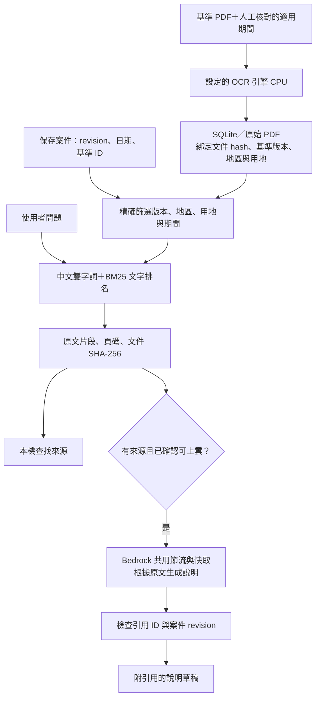

# 基準文件 RAG（v1）

已實作「檢索 → 提供原文 → Bedrock 生成附引用說明」。`RAG_BACKEND=local` 為下述本機開發流程；`bedrock-kb` 改用 AWS Knowledge Bases，純檢索也需上雲同意，來源需顯式同步，詳見 [AWS RAG 與新增 Agent 工具](aws-rag.md)。Agent 另接政府 API 候選查詢、缺漏檢查及既有計算函式；[原四工具說明](agentic-rag.md) 保留基礎設計背景。

## 使用

1. 開啟已保存案件，確認地區、用地與選定基準一致，估價日為西元 YYYY-MM-DD 或民國 YYYMMDD。
2. 按「依據問答」，展開「管理這個基準版本的來源 PDF」。填寫從文件確認的適用起迄日，選擇 PDF，按「辨識並加入來源」。日期含首尾；未知期間請先核對，不填猜測日期。
3. 設定的 OCR 引擎在本機辨識並保存。不同基準版本需要各自加入來源，不會自動複製或掃描整個 aws 資料夾。
4. 輸入問題，例如「面前道路寬度的級距如何規定？」並按「本機查找來源」。結果包含原文、文件、頁碼、基準版本及適用期間，可開啟原 PDF。
5. 需要文字說明時，確認問題與來源符合競賽上雲規範，再按「AWS 生成說明」。只送問題與檢索片段，不送整份案件。AI 文字仍須人工核對；無依據不生成答案。

未確認的 OCR 或不適用文件不能當成已核准規則。系統不驗證上傳者填寫的適用期間是否符合原文，也不從 RAG 修改計算引擎。

## 執行流程

先篩選再排名。文字切片最多 800 字元、相鄰步距 680；回傳前 5 筆。rule_ids 可限制該版本因素的 source_page；未提供時檢索所有適用來源頁。未索引其他案件 PDF、未使用向量資料庫或 GraphRAG。

## API

- `POST /api/rulesets/{id}/evidence-documents?valid_from=2025-01-01&valid_to=2025-12-31&name=rules.pdf`：body 為 PDF bytes，上限 20 MB，OCR 限制沿用現有 reader。
- `GET /api/rulesets/{id}/evidence-documents`：列出該版本來源與期間，不回傳本機路徑。
- `POST /api/cases/{id}/evidence`：`{"revision":1,"question":"寬度級距","generate":false,"cloud_data_approved":false,"rule_ids":[]}`。
- `generate=true` 使用 Bedrock；無來源則不呼叫。查詢及生成前後皆檢查案件 revision，不寫回案件、確認或 audit。

新建 evidence_documents 表與複合索引，既有資料不重建。來源文件及綁定一同提交；來源不可覆寫。暫無來源移除／修訂 UI，新增基準版本時應重新加入正確來源。檢索每次從持久化 OCR 文字建立小型排名集合，適合目前單機小型文件庫；大型語料索引與向量召回需後續評估。

## 驗證與限制

單元／API 測試使用合成來源，驗證不同版本、地區、用地與期間不混用、引用可還原原文字元區間、日期邊界、無來源不呼叫模型、過期 revision、雲端同意、未知引用拒收、快取與關閉模型的行為。瀏覽器測試使用合成掃描 PDF 跑真實 CPU PaddleOCR（相同檔案可重用 OCR 快取），模型說明以合成回應驗證 UI。

本版是可測試的文字檢索基線，尚無正式問題集的召回率／回答正確率報告。引用 ID 有效不代表句子受原文支持；OCR 品質、同頁混合條款、同義詞、表格跨頁與互相矛盾來源仍需人工核對。模型沒有執行工具或寫回案件權限；不把說明視為計算結果或規則核准。

使用 [AWS Converse API](https://docs.aws.amazon.com/bedrock/latest/APIReference/API_runtime_Converse.html)，沿用現有區域模型、共用鎖、至少 1.1 秒 gate、最多三次嘗試及 SDK 憑證鏈。無新增雲端資源或額外套件。
